# Remote Agriculture System

## i. Introduction to the Problem and the Solution

Remote Agriculture System is an ESP32 based automated system to monitor the status of your plants in order to provide them with the most ideal environment in order to maximize their growth. This system will also provide remote control uses such as turning on the light and pumping water to your plants using Blynk.

The absence of a reliable monitoring system leads to the inefficient use of resources such as water and energy, reducing the effectiveness of farming practices. Additionally, modern farmers are increasingly asked to be environmentally friendly, using fewer resources and taking care of the environment. The existing tools are not well-equipped to meet these new demands.

Therefore, there is a genuine need for an advanced system that provides farmers with real-time information about their crops. This system should be user-friendly and assist farmers in making informed decisions to protect their crops and adopt sustainable practices. The proposed solution is the "Remote Agriculture System," utilizing a smart device called the ESP32 and various sensors to give farmers a comprehensive understanding of their crops, making farming more intelligent and resource-efficient.

## ii. Hardware Design and Implementation Details

The hardware and design implementation of the Remote Agriculture Systems involves several components and considerations to ensure accurate monitoring and reliable performance. The following are the key hardware components :

### Components:

**1. ESP32**

    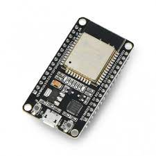 

**2. YL39 sensor**

    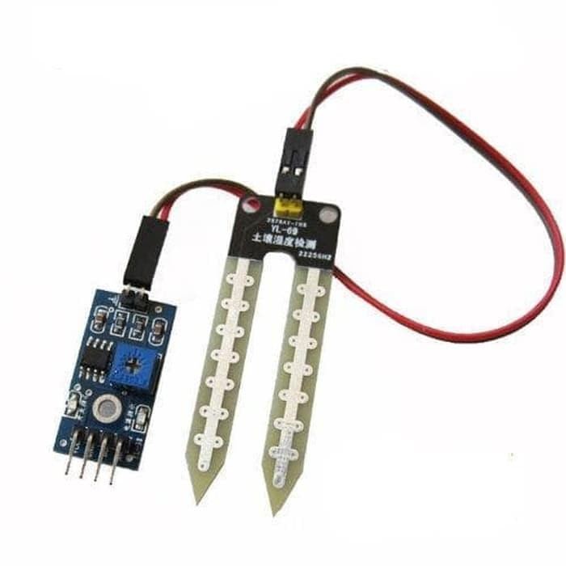 

**3. DHT11 sensor**

    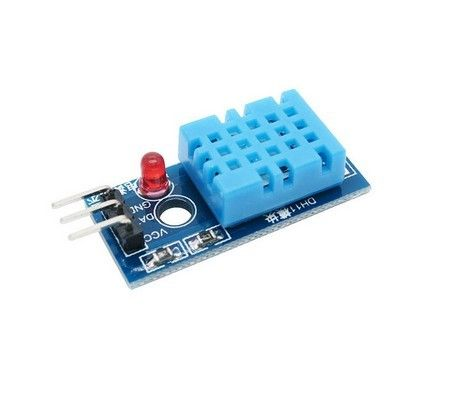 

**4. 2 LEDs**

    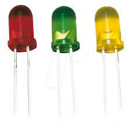 

**5. LDR Module**

    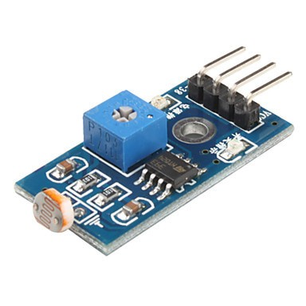 

**6. Water Pump**

    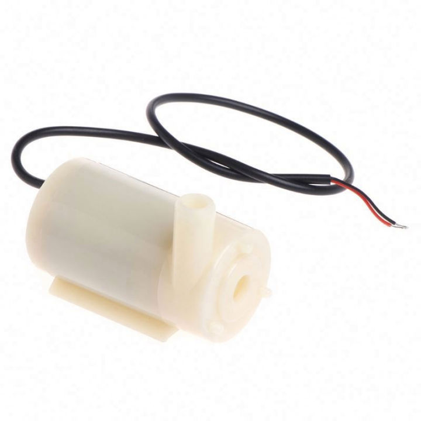 

Sensors:

**a. YL39:** A moisture sensor YL39 is used to measure the moisture level in the soil or growing medium.

**b. DHT11:** A temperature and humidity sensor, such as the DHT series sensor, is utilized to measure ambient temperature and humidity. 

**c. LDR:** A light-dependent resistor (LDR) is used to measure the intensity of light in the plant's environment. 

Project Schematic : 

    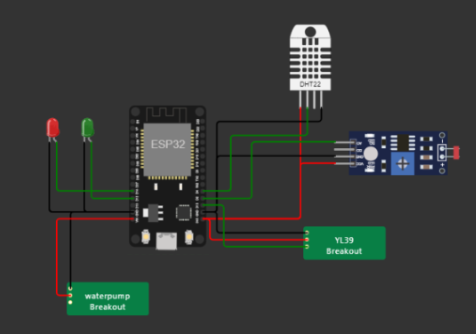 

## iii. Network Infrastructure

Remote Agriculture System use a software called Blynk, in which in order to connect to Blynk we need to connect to the WiFi first. And we use this to based our network infrastructure, the communicatiom between ESP32, Blynk Cloud, and Blynk application are using TCP protocol. To make it easier to understand here is our network infrastructure schematic : 

    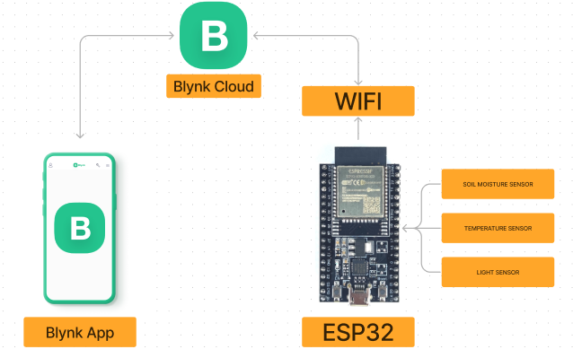

And for us to connect to the WiFi network we need to fill in SSID and pass credentials like this : 

    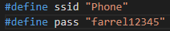

And lastly in order to connect to Blynk, we need to use these credentials :

    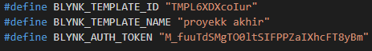

Now after everything has been setup correctly, communication between Blynk and ESP32 has been established, and we just need to add our own datastream that will display our needs such as temperature, soil moisture and light intensity.

## iv. Software Implementation Details

Discuss the software aspects of your project. This includes the programming languages, frameworks, and libraries used. Provide instructions on how to set up and run the software.

## v. Test Results and Performance Evaluation

All individual components pass the unit testing phase successfully, YL39 moisture sensor is able to pick up accurate moisture level readings, the LDR can catch light reading pretty accurately, DHT11 can accurately update temperature in real time. And each LED and water pump is working as expected as well.

    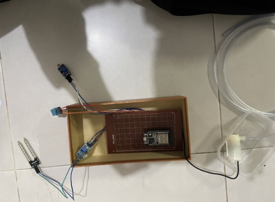 

The integration testing phase verified that the components of the Remote Agriculture System were effectively integrated. Data flow between modules was smooth, and the system provided accurate and real-time readings of environmental parameters for the plant such as its temperature, soil moisture, and the light reading.

    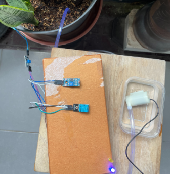 

During the user acceptance testing, the Remote Agriculture System exhibited successful performance when all the components were connected and operated together, simulating a real-world environment. The system effectively produced accurate readings, displaying the environmental temperature on Blynk. Additionally, the moisture level and light level were successfully presented on the display, as evidenced by the status indicators. This outcome affirms the system's capability to provide relevant and reliable data in diverse environmental conditions.

| Status |  LED 1  | LED 2    | Pump   |
| ------ | ------- | -------- | ------ |
| M / B  | OFF     | OFF      | OFF    |
| M / G  | OFF     | ON       | OFF    |
| D / B  | ON      | OFF      | ON     |
| D / G  | ON      | ON       | ON     |

Notes:
* M = Moist
* D = Dry
* B = Bright
* G = Gelap

## vi. Conclusion and Future Work

Remarkably, the system effectively fulfilled its primary objective of automating agriculture monitoring, delivering dependable measurements of crucial parameters like moisture levels, temperature, and light level. User acceptance testing garnered positive feedback, indicating a high level of accuracy. The impact of the system extends to improved agricultural practices, significant time savings, and a notable reduction in the risks associated with plant damage.

### Future Work
Even though Remote Agriculture System had already fulfilled it's primary goals, further improvements can still be done, such as : 
1. Upscaling the project so it can accommodate bigger farms.
2. Incorporate more control over the system such as turning on the light manually and pouring water manually.

# How to Run

Include instructions on how to set up and run your project. List any dependencies and provide step-by-step guidance for users or developers who want to try your solution.

# Contributors

* Muhammad Farrel Mirawan		        2106731554
* Jeremy Ganda Pandapotan				    2106731573
* Handaneswari Pramudhyta Imanda		2106731346
* Sulthan Satrya Yudha Darmawan			2106731560
  
